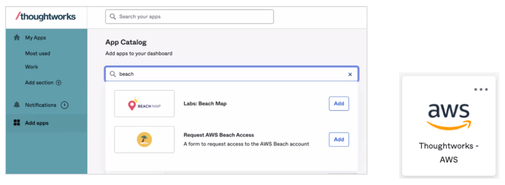

# Infra as Code - Assignment for IaC Course

## AWS Beach Account Access

This README provides details on how to access the TW AWS Beach account via the AWS Console (UI) and the AWS CLI. 


#### AWS Console Access

You can grant permissions for yourself to access the TW AWS beach account via Okta.  Click on “Add apps” in the left hand menu, type “beach” into the search field, click “Add” next to “Request AWS Beach Access”, then you should have a new tile available for AWS access.




#### AWS CLI Installed and Configured

Before trying to access the TW AWS Beach account via the CLI you should have already added it via Okta, see above.

To install AWS CLI run the following if it's not already installed:

```
brew install awscli
```

For the AWS CLI to authenticate with AWS from your laptop you will need to configure a profile which provides authentication configuration.  The AWS beach account (along with most TW AWS accounts) is configured to use Single Sign-On (SSO) therefore the profile should have SSO configuration.  Once a profile is created you can run the `aws sso login` command in a terminal using the AWS CLI and reference your profile as an input parameter in the command.  This will open a web page hosted by AWS which asks you to authorise the authentication request.  Assuming you authorise the request via the web page then the terminal will recognise this and your AWS CLI will now be authenticated.  This authenticated session uses short lived credentials provided by AWS STS (Security Token Service) which by default will expire after 12 hours after which you will have to re-authenticate.  You can ensure your profile is recognised in the terminal for all future AWS CLI commands by adding the AWS_PROFILE environment variable.  I'll now step you through configuring this.

1. Firstly, you need to create the AWS profile by adding this snippet of code into `~/.aws/config`.  You should do this only if you don’t already have it configured (also create the config file if it doesn't exist).  In the snippet below you can optionally update the profile name, role name, region and output as you see fit):

```
[profile twbeach]
sso_start_url = https://thoughtworks-sso.awsapps.com/start
sso_region = eu-central-1
sso_account_id = 160071257600
sso_role_name = PowerUserPlusRole
region = ap-southeast-2
output = json
```

2. Now you can test authenticating with AWS by running the following command in your terminal (update the profile name to the profile you are using).

```
aws sso login --profile twbeach
```

3. It should open a browser window and will prompt you to authorise the request.  Once authorised you should run the following to set your AWS profile as an environment variable in your terminal (update the profile name to the profile you are using):

```
export AWS_PROFILE=twbeach
```

4. Now if you run any AWS commands it will detect you are already authenticated and you should be able to interact with AWS from the command line using the AWS CLI.  Here's some commands you can run to test it out:

```
aws sts get-caller-identity
aws ec2 describe-regions
```

You are now ready to proceed with the exercise.
