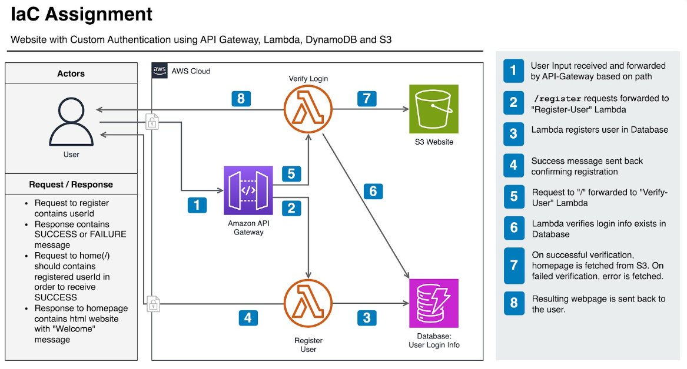

# Infra as Code - Assignment for IaC Course

## Overview
It provides api gateway to register and verify users. The api gateway is integrated with lambda function to handle the requests. The lambda function is written in python and it uses dynamodb to store the user data.

### Architecture



### Pre-requisites
- create s3 bucket for terraform state: tw-infra-taohui-tfstate
- create dynamodb table for terraform state lock: tw-infra-taohui-tfstate-locks

### Generate zip file for lambda function
When we configure the terraform for lambda function, we need to provide the zip file for the lambda function. 
The following commands are used to generate the zip file for the lambda function.
```bash
cd src
zip -r register_user.zip register_user.py
zip -r verify_user.zip verify_user.py
mv register_user.zip ../register_user.zip
mv verify_user.zip ../verify_user.zip
```

### Lambda Proxy Integration
When you choose Lambda Proxy Integration with AWS API Gateway, it means that API Gateway will pass the entire HTTP request to your Lambda function as a single event object. This integration allows you to handle the entire request and response cycle within your Lambda function, giving you more control over the processing of requests.

Example request for Lambda Proxy Integration:
```
{
    "queryStringParameters":
    {
        "userid": "taohui"
    },
    "rawQueryString": "userid=taohui",
    "requestContext":
    {
        "accountId": "123456789012",
        "apiId": "api-id",
        "http":
        {
            "method": "POST",
            "path": "/",
            "protocol": "HTTP/1.1",
            "sourceIp": "192.168.0.1/32",
            "userAgent": "agent"
        },
        "requestId": "id",
        "routeKey": "$default",
        "stage": "$default",
        "time": "12/Mar/2020:19:03:58 +0000",
        "timeEpoch": 1583348638390
    }
}
```
